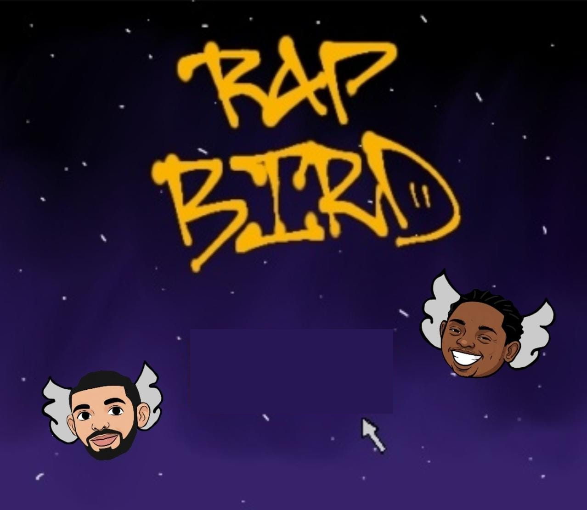

# Rap Bird



## Descrição

Rap Bird é um jogo simples e divertido de duas pessoas inspirado no clássico Flappy Bird. Dois jogadores competem simultaneamente para voar pelos canos e obter a maior pontuação, controlando seus pássaros com teclas distintas.

Este projeto foi desenvolvido em Python usando a biblioteca Pygame.

---

## Recursos

- Suporte para dois jogadores simultâneos (multiplayer local).
- Gráficos personalizados, animações e sons (incluídos na pasta `assets`).
- Tela inicial, tela de vitória e opções para reiniciar ou sair.
- Contagem de pontuação individual para cada jogador.

---

## Controles

| Jogador Vermelho | Jogador Azul  |
|------------------|---------------|
| Tecla `W`        | Tecla `Seta para cima` |

- Pressione o botão START para iniciar o jogo.
- Durante o jogo, pressione a tecla correspondente para fazer o pássaro "voar" (pular).
- Ao final do jogo, pressione:
  - `R` para reiniciar.
  - `Q` para sair.

---

## Requisitos para executar o jogo

- Python 3.7 ou superior.
- Biblioteca Pygame instalada (`pip install pygame`).

---

## Como executar (para usuários com Python instalado)

1. Clone este repositório ou baixe os arquivos.
2. Abra um terminal na pasta do projeto.
3. Instale a biblioteca Pygame, caso não tenha:


pip install pygame


4. Execute o jogo com:

python main.py


## Estrutura do projeto

Rap-Bird/
│
├── assets/               # Imagens e sprites usados no jogo
│   ├── start.png
│   ├── game_bg.png
│   ├── start_button.png
│   ├── red_win.png
│   ├── blue_win.png
│   ├── restart_button.png
│   ├── red_bird_open.png
│   ├── red_bird_closed.png
│   ├── blue_bird_open.png
│   ├── blue_bird_closed.png
│   └── pipe.png
│
├── main.py               # Código fonte principal do jogo
└── README.md             # Este arquivo de documentaçã


## Observações

* Certifique-se que a pasta `assets` está na mesma pasta que o arquivo que o script `main.py` para que as imagens sejam carregadas corretamente.
* O jogo foi testado em Windows 10 e 11.


## Licença

Este projeto está aberto para uso e modificação. Sinta-se à vontade para contribuir.


---

Quer que eu gere também o arquivo `.exe` para você ou que explique como fazer isso detalhadamente?
```
